## Approach 1 - Naive

I start by splitting the image into 3 sections, one for each channel. 
I also cropped the image to 90% of its original size to get rid of any borders. 
Then, I took a pair of channels (e.g. red and blue), and tried to find the best positioning that would minimize the **Normalized Cross-Correlation Loss**, which was the negative of the normalized matrices: 

$$
    \frac{L_1}{\lVert L_1 \rVert_F} \cdot \frac{L_2}{\lVert L_2 \rVert_F}
$$

where we use the Frobenius Norm for each layer.
To find the best position, I shifted the first layer in the x and y direction in the range of -20px to 20px, and found the positioning that had the minimal loss. 
I did this for 2 different pairs (red-blue & green-blue), and moved the layers accordingly. 
Finally, I trimmed off any area that did not have all 3 layers on it.

<table style="width:90%; table-layout:fixed;">
    <tr>
        <th style="text-align:center;">
            <strong>Cathedral</strong>
        </th>
        <th style="text-align:center;">
            <strong>Monastery</strong>
        </th>
        <th style="text-align:center;">
            <strong>Tobolsk</strong>
        </th>
    </tr>
    <tr>
        <td style="text-align:center;">
            <figure style="margin:0;">
                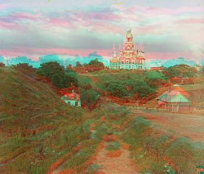
                <figcaption>Red: (1, 0)   Green: (2, 5)</figcaption>
            </figure>
        </td>
        <td style="text-align:center;">
            <figure style="margin:0;">
                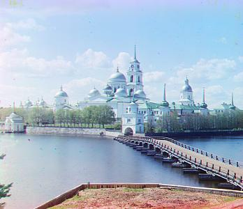
                <figcaption>Red: (2, 3)   Green: (2, -3)</figcaption>
            </figure>
        </td>
        <td style="text-align:center;">
            <figure style="margin:0;">
                Red: (3, 6)   Green: (3, 3)</figcaption>
            </figure>
        </td>
    </tr>
</table>

This approach works fine for relatively small images (300-400px), but does not scale well for larger images. 
If we maintain the same search window for a larger image, we may not cover enough of a search space to accurately recover the correct positioning of the layer. 
It is also infeasible to scale the search window with the image size, since the runtime grows quadratically with the sides of the image. 
For example, if we scale the image by a factor of 2, we would have to scale up our search window by a factor of 4.

## Approach 2 - Image Pyramid
Because of the lack of scalability for the naive approach, I resorted to using an image pyramid to reduce the search space dramatically.
I initially scaled down the image to around 500px along its longest side, and calculated the optimal shifts for each channel in a window of ±20px in each direction. 
Then, I would scale up the image by a factor of 2 and pre-shift each of the layers by twice the originally calculated displacements. 
From here, I could again run the same algorithm with a significantly smaller search window (±3px), since I knew it was already close to an optimal alignment. 
From there, I would repeat this process until reaching the original resolution. 
This allows us to vastly expand our search window and decrease our runtime, since after the first iteration, we only need to check a fraction of the possible displacements.

Although this approach allowed us to process larger images, there were still issues in certain cases. 
For example, with the Emir, various features of red and blue channels differ too greatly: the emir's clothes have a high amount of blue but a low amount of red, while the doors and floor have more red with less blue. 
As such, simply using the raw channel values is not enough.

<figure style="text-align:center; width:50%; margin:auto;">
  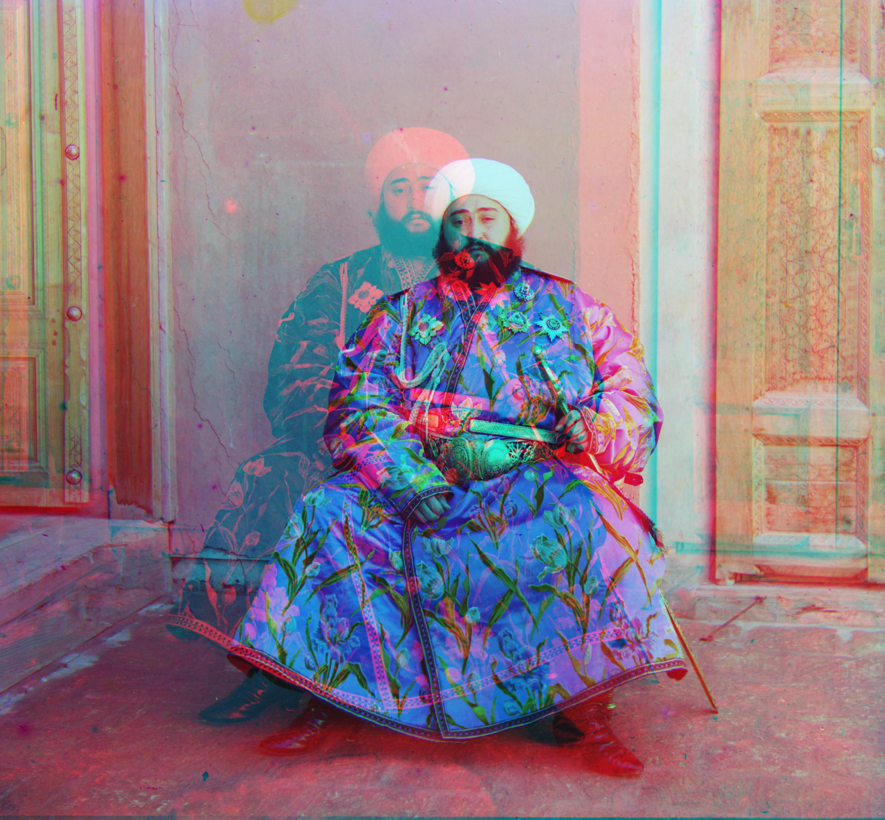
  <figcaption>
    RGB Pyramid is unable to resolve channels with varying brightness.
  </figcaption>
</figure>

## Approach 3 - Edge Detection

To combat the problem, instead of matching raw values, I decided to match edges of channels. 
This helps solve the problem with the Emir image, since each channel could have different intensities for the same part of the image. 
For instance, the Emir photo has lots of red and no blue in the background, but little red and lots of blue in the subject of the image.

In order to detect edges, I used Sobel edge detection. 
The process starts by applying a gaussian blur to the image to smooth out the noise in the image. 
Then, it takes the blurred channel and convolves it with two 3x3 kernels to detect horizontal and vertical edges ($E_x$ and $E_y$). 
More specifically, if $A$ is the channel, we have 

$$
    E_x =
    \begin{bmatrix}
    +1 & 0 & -1 \\
    +2 & 0 & -2 \\
    +1 & 0 & -1
    \end{bmatrix}
    * A
$$

$$
    E_y =
    \begin{bmatrix}
    -1 & -2 & -1 \\
    0 & 0 & 0 \\
    +1 & +2 & +1
    \end{bmatrix}
    * A
$$

where $*$ is the normed 2D convolution operator. From here, we take the can approximate the magnitude of the gradient by

$$
    E = 
    \sqrt{E_x^2 + E_y^2}
$$

From here, I applied this transformation to each layer of our image pyramid and compared the losses of the edges and got significantly better results. 
For the convolution, I set the `mode='same'` and `boundary='symm'`.

<table style="width:90%; table-layout:fixed;">
    <tr>
        <th style="text-align:center;">
            <strong>Before (RGB Similarity)</strong>
        </th>
        <th style="text-align:center;">
            <strong>After (Sobel Edge Detection)</strong>
        </th>
    </tr>
    <!--  Emir -->
    <tr>
        <td style="text-align:center;">
            <figure style="margin:0;">
                
                <figcaption>Red: (-162, 0)   Green: (24, 49)</figcaption>
            </figure>
        </td>
        <td style="text-align:center;">
            <figure style="margin:0;">
                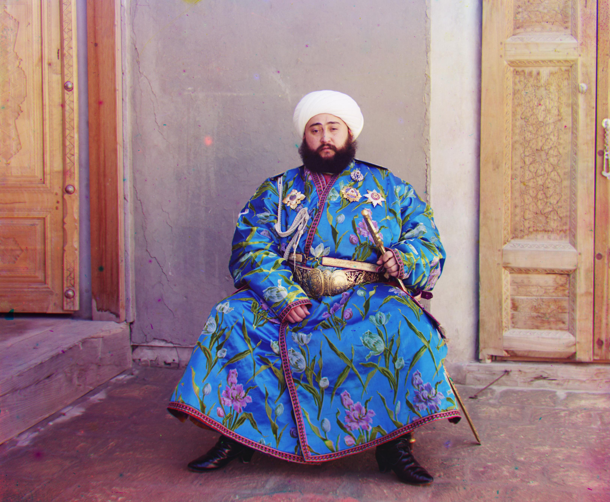Red: (40, 107)   Green: (23, 49)</figcaption>
            </figure>
        </td>
    </tr>
    <!-- Italil -->
    <tr>
        <td style="text-align:center;">
            <figure style="margin:0;">
                
                <figcaption>Red: (35, 77)   Green: (21, 38)</figcaption>
            </figure>
        </td>
        <td style="text-align:center;">
            <figure style="margin:0;">
                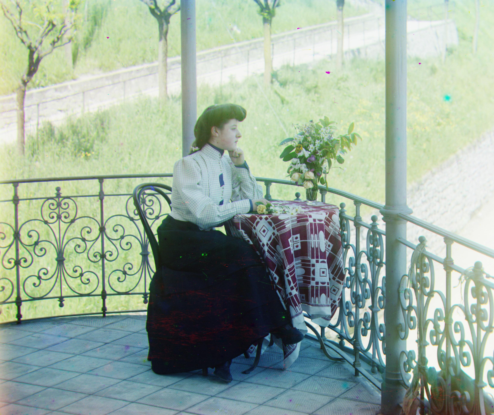Red: (36, 77)   Green: (22, 39)</figcaption>
            </figure>
        </td>
    <!-- Church -->
    <tr>
        <td style="text-align:center;">
            <figure style="margin:0;">
                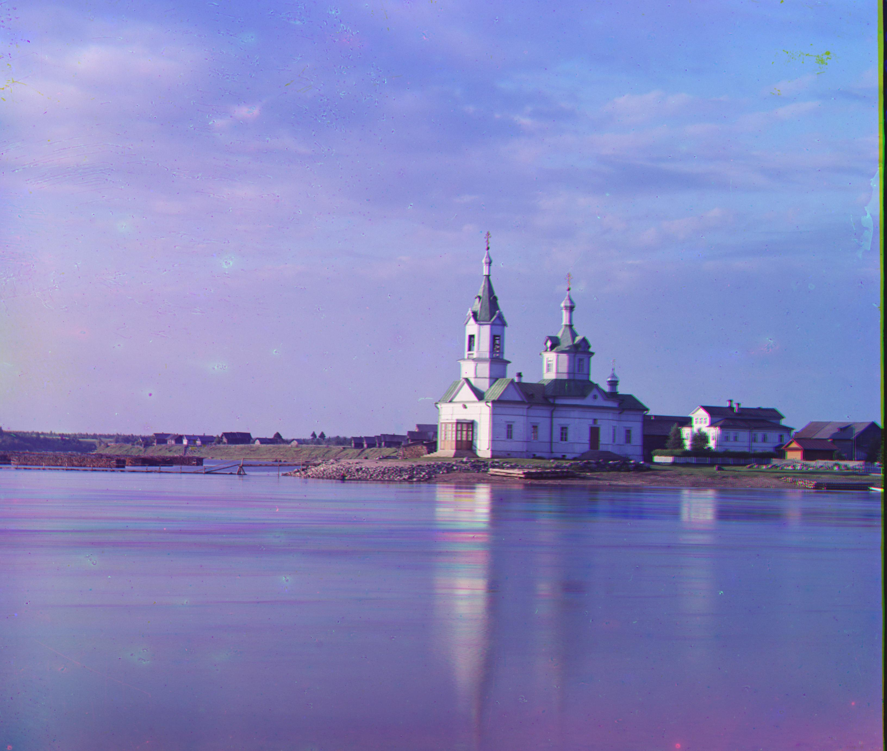
                <figcaption>Red: (-4, 58)   Green: (0, 25)</figcaption>
            </figure>
        </td>
        <td style="text-align:center;">
            <figure style="margin:0;">
                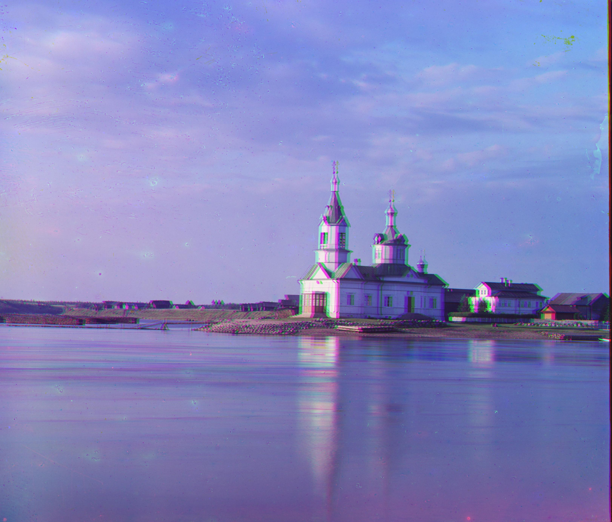Red: (-4, 58)   Green: (-13, 24)</figcaption>
            </figure>
        </td>
    </tr>
    <!-- Three Generations -->
    <tr>
        <td style="text-align:center;">
            <figure style="margin:0;">
                
                <figcaption>Red: (9, 112)   Green: (11, 54)</figcaption>
            </figure>
        </td>
        <td style="text-align:center;">
            <figure style="margin:0;">
                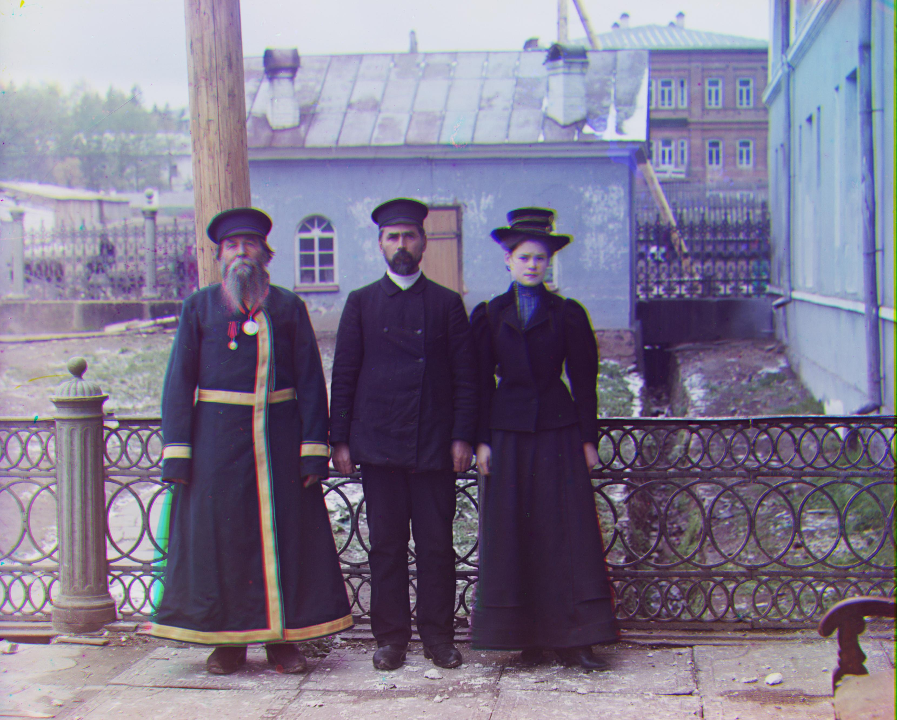Red: (8, 111)   Green: (12, 54)</figcaption>
            </figure>
        </td>
    </tr>
    <!-- Lugano -->
    <tr>
        <td style="text-align:center;">
            <figure style="margin:0;">
                
                <figcaption>Red: (-28, 92)   Green: (-16, 41)</figcaption>
            </figure>
        </td>
        <td style="text-align:center;">
            <figure style="margin:0;">
                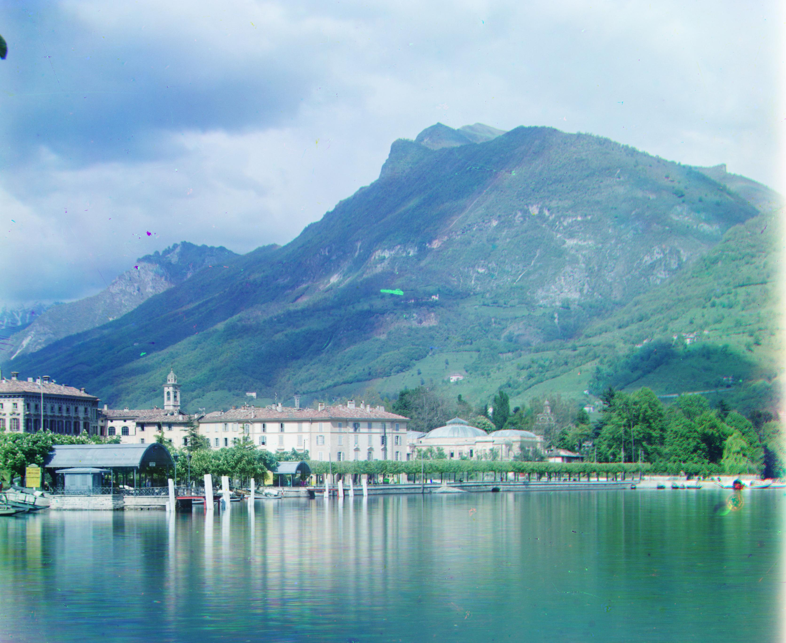Red: (-29, 91)   Green: (-17, 41)</figcaption>
            </figure>
        </td>
    </tr>
    <!-- Melons -->
    <tr>
        <td style="text-align:center;">
            <figure style="margin:0;">
                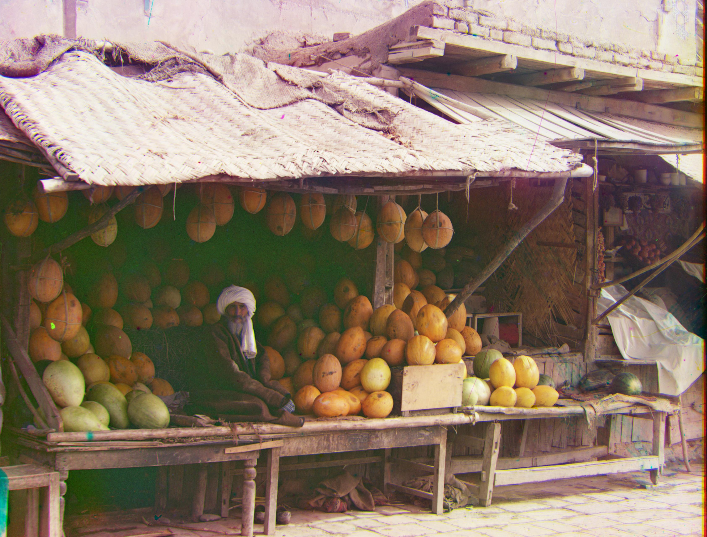
                <figcaption>Red: (12, 178)   Green: (9, 82)</figcaption>
            </figure>
        </td>
        <td style="text-align:center;">
            <figure style="margin:0;">
                Red: (12, 177)   Green: (10, 80)</figcaption>
            </figure>
        </td>
    </tr>
    <!-- Lastochikino -->
    <tr>
        <td style="text-align:center;">
            <figure style="margin:0;">
                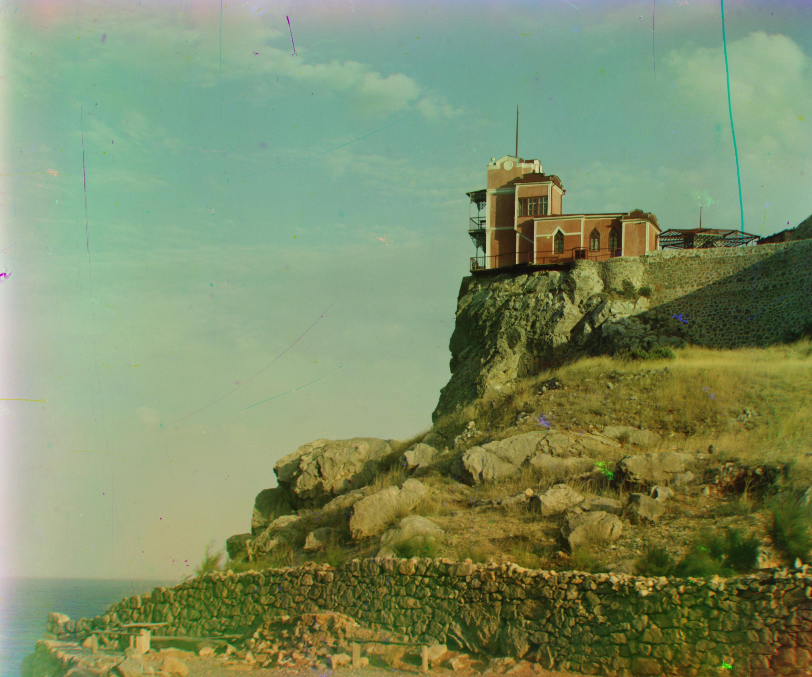
                <figcaption>Red: (-8, 75)   Green: (-1, -3)</figcaption>
            </figure>
        </td>
        <td style="text-align:center;">
            <figure style="margin:0;">
                Red: (-8, 75)   Green: (-2, -3)</figcaption>
            </figure>
        </td>
    </tr>
    <!-- Tobolsk -->
    <tr>
        <td style="text-align:center;">
            <figure style="margin:0;">
                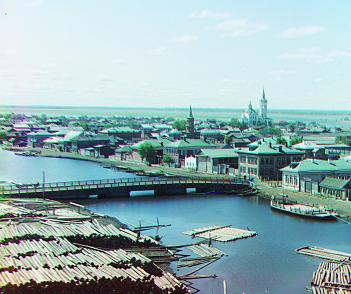
                <figcaption>Red: (3, 6)   Green: (3, 3)</figcaption>
            </figure>
        </td>
        <td style="text-align:center;">
            <figure style="margin:0;">
                Red: (3, 6)   Green: (3, 3)</figcaption>
            </figure>
        </td>
    </tr>
    <!-- Icon -->
    <tr>
        <td style="text-align:center;">
            <figure style="margin:0;">
                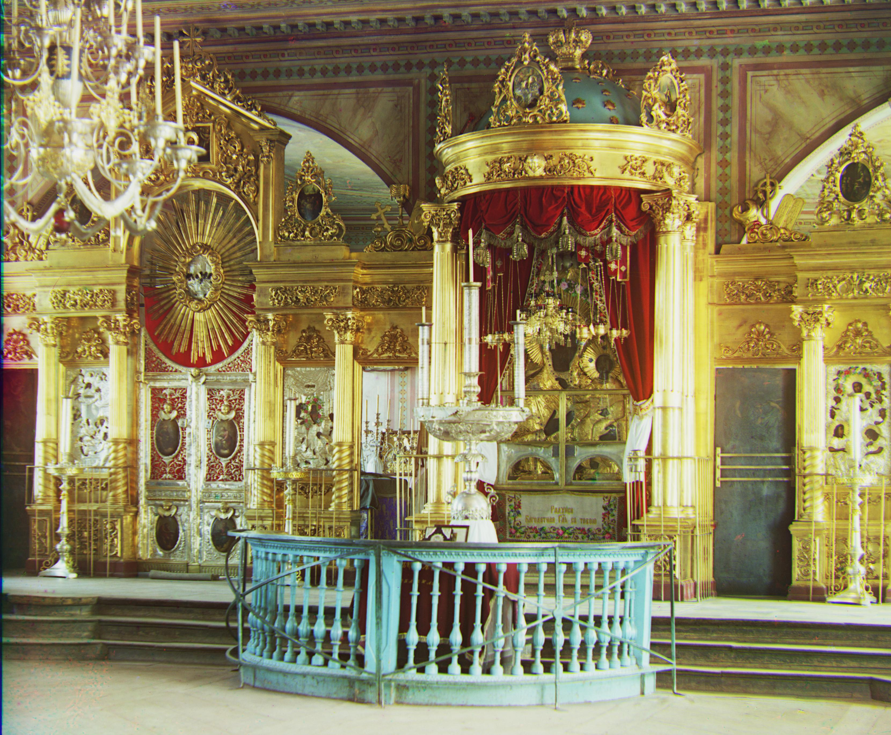
                <figcaption>Red: (23, 89)   Green: (17, 40)</figcaption>
            </figure>
        </td>
        <td style="text-align:center;">
            <figure style="margin:0;">
                Red: (23, 90)   Green: (17, 42)</figcaption>
            </figure>
        </td>
    </tr>
    <!-- Cathedral -->
    <tr>
        <td style="text-align:center;">
            <figure style="margin:0;">
                
                <figcaption>Red: (1, 0)   Green: (2, 5)</figcaption>
            </figure>
        </td>
        <td style="text-align:center;">
            <figure style="margin:0;">
                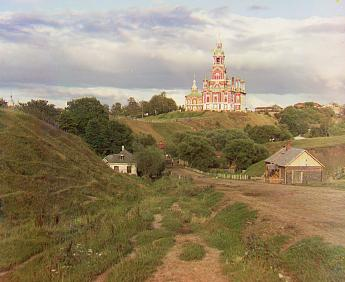Red: (3, 12)   Green: (2, 5)</figcaption>
            </figure>
        </td>
    </tr>
    <!-- Siren -->
    <tr>
        <td style="text-align:center;">
            <figure style="margin:0;">
                
                <figcaption>Red: (-25, 95)   Green: (-7, 49)</figcaption>
            </figure>
        </td>
        <td style="text-align:center;">
            <figure style="margin:0;">
                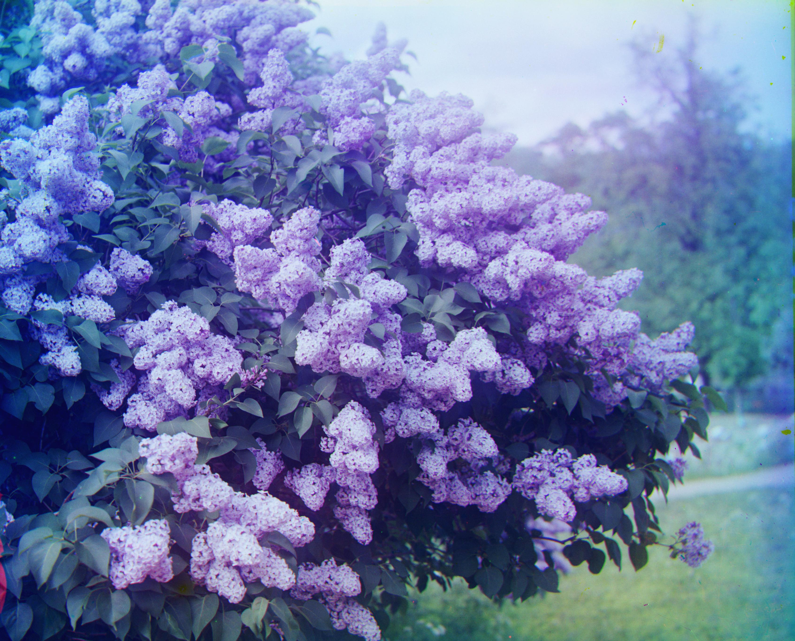Red: (-24, 96)   Green: (-7, 49)</figcaption>
            </figure>
        </td>
    </tr>
    <!-- Self Portrait -->
    <tr>
        <td style="text-align:center;">
            <figure style="margin:0;">
                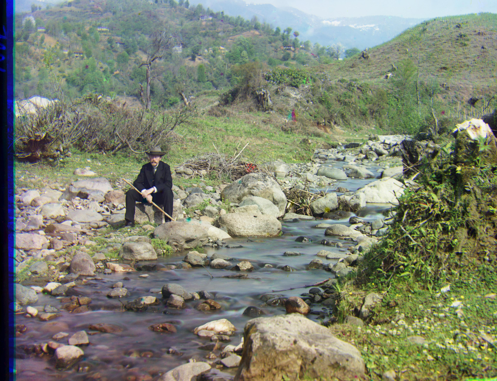
                <figcaption>Red: (36, 176)   Green: (28, 78)</figcaption>
            </figure>
        </td>
        <td style="text-align:center;">
            <figure style="margin:0;">
                Red: (37, 176)   Green: (29, 78)</figcaption>
            </figure>
        </td>
    </tr>
    <!-- Harvesters -->
    <tr>
        <td style="text-align:center;">
            <figure style="margin:0;">
                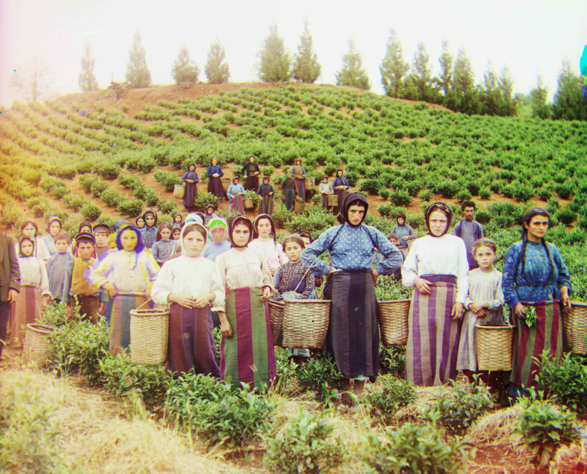
                <figcaption>Red: (13, 124)   Green: (16, 60)</figcaption>
            </figure>
        </td>
        <td style="text-align:center;">
            <figure style="margin:0;">
                Red: (13, 123)   Green: (17, 60)</figcaption>
            </figure>
        </td>
    </tr>

</table>