## Part 1: Fun with Filters

### Part 1.1: Convolutions from scratch

The times for the runs were the following:
- 4 loops time: 2m 18.17s
- 2 loops time: 55.61s
- SciPy time: 1.06s

```py
def conv2d_4loops(image, kernel):
    h, w = image.shape
    kh, kw = kernel.shape
    pt, pb = kh // 2, kh - 1 - kh // 2
    pl, pr = kw // 2, kw - 1 - kw // 2
    padded = np.pad(image, ((pt, pb), (pl, pr)), mode='constant', constant_values=0)
    output_h = h
    output_w = w
    output = np.zeros((output_h, output_w))

    for i in range(output_h):
        for j in range(output_w):
            conv_val = 0
            for m in range(kh):
                for n in range(kw):
                    conv_val += padded[i + m, j + n] * kernel[m, n]
            output[i, j] = conv_val

    return output
```
```py
def conv2d_2loops(image, kernel):
    h, w = image.shape
    kh, kw = kernel.shape
    pt, pb = kh // 2, kh - 1 - kh // 2
    pl, pr = kw // 2, kw - 1 - kw // 2
    padded = np.pad(image, ((pt, pb), (pl, pr)), mode='constant', constant_values=0)
    output_h = h
    output_w = w
    output = np.zeros((output_h, output_w))

    for i in range(output_h):
        for j in range(output_w):
            region = padded[i:i+kh, j:j+kw]
            output[i, j] = np.sum(region * kernel)
    
    return output
```

<table style="width:90%; table-layout:fixed;">
    <tr>
        <td colspan="3" style="text-align:center; width:33%;">
            <figure style="margin:0;">
                <figcaption>Original</figcaption>
                
                <!-- Note: We're shrinking it by multiplying 33.3 by 0.9 -->
            </figure>
        </td>
    </tr>
    <!-- Alternate way to make centered -->
    <!-- <tr>
        <td style="text-align:center;">
        </td>
        <td style="text-align:center;">
            <figure style="margin:0;">
                <figcaption>Original</figcaption>
                
            </figure>
        </td>
        <td style="text-align:center;">
        </td>
    </tr> -->
    <tr>
        <td style="text-align:center;">
            <figure style="margin:0;">
                <figcaption>4 Loop Box Filter</figcaption>
                
            </figure>
        </td>
        <td style="text-align:center;">
            <figure style="margin:0;">
                <figcaption>4 Loop Dx Filter</figcaption>
                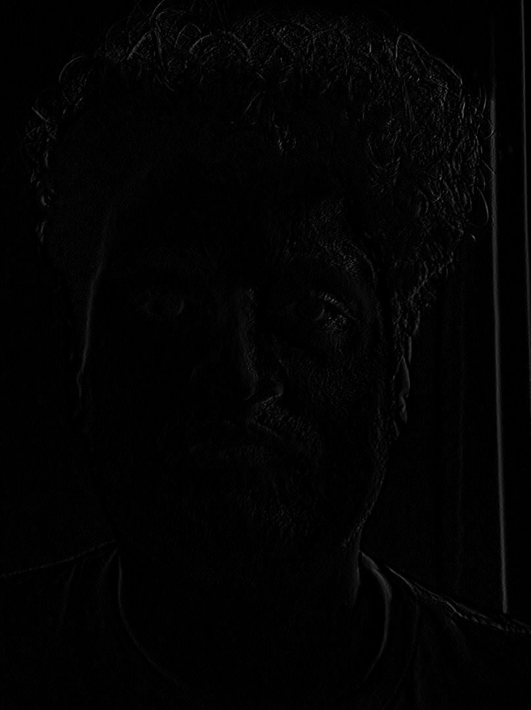
            </figure>
        </td>
        <td style="text-align:center;">
            <figure style="margin:0;">
                <figcaption>4 Loop Dy Filter</figcaption>
                
            </figure>
        </td>
    </tr>
    <tr>
        <td style="text-align:center;">
            <figure style="margin:0;">
                <figcaption>2 Loop Box Filter</figcaption>
                
            </figure>
        </td>
        <td style="text-align:center;">
            <figure style="margin:0;">
                <figcaption>2 Loop Dx Filter</figcaption>
                
            </figure>
        </td>
        <td style="text-align:center;">
            <figure style="margin:0;">
                <figcaption>2 Loop Dy Filter</figcaption>
                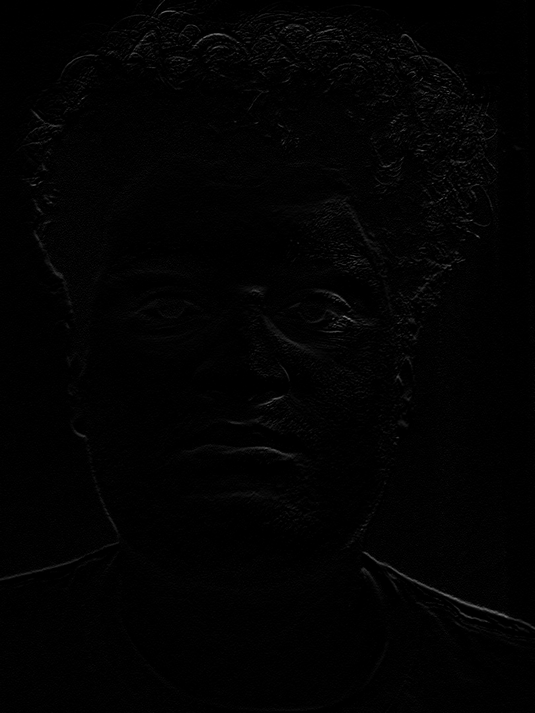
            </figure>
        </td>
    </tr>
    <tr>
        <td style="text-align:center;">
            <figure style="margin:0;">
                <figcaption>SciPy Loop Box Filter</figcaption>
                
            </figure>
        </td>
        <td style="text-align:center;">
            <figure style="margin:0;">
                <figcaption>SciPy Dx Filter</figcaption>
                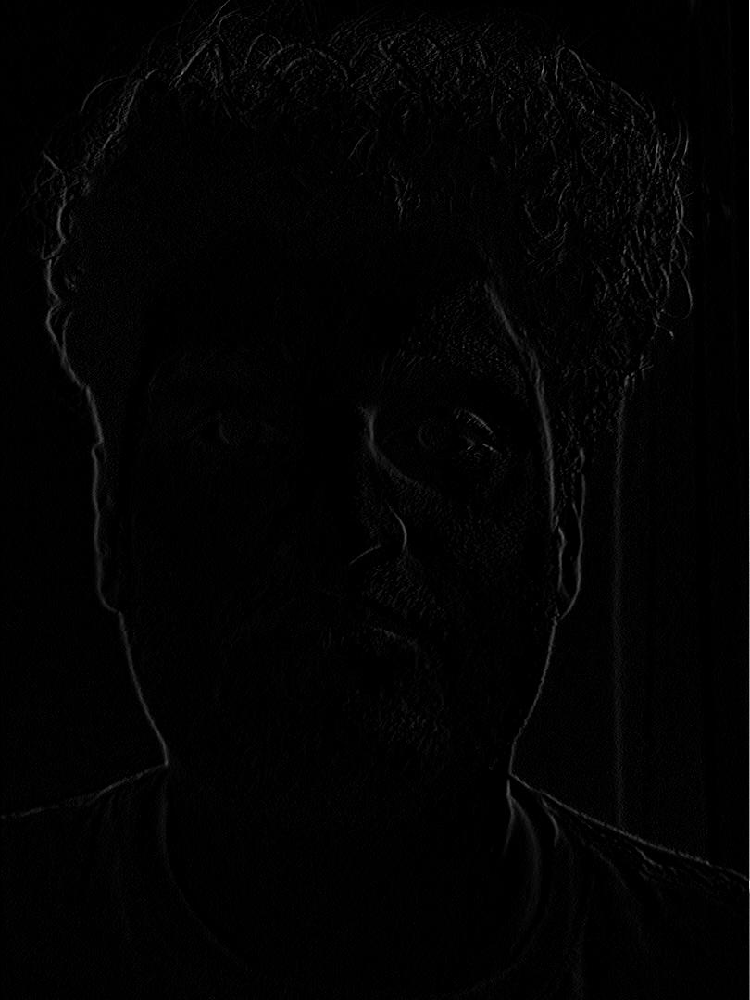
            </figure>
        </td>
        <td style="text-align:center;">
            <figure style="margin:0;">
                <figcaption>SciPy Dy Filter</figcaption>
                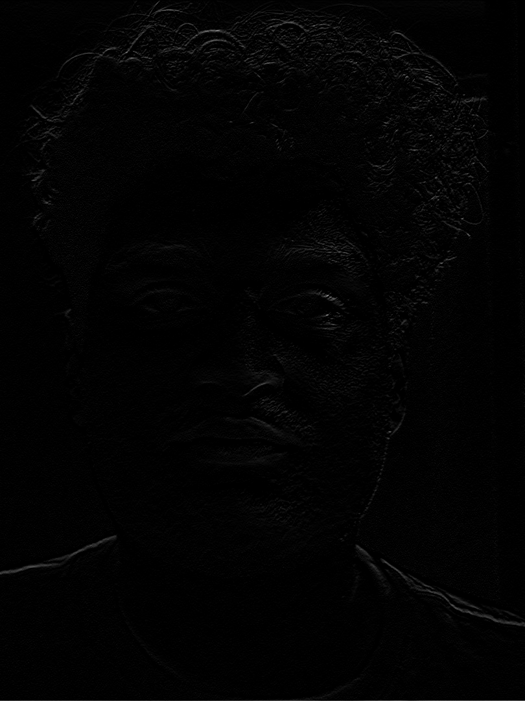
            </figure>
        </td>
    </tr>
</table>

### Part 1.2 Finite Difference Operator
The finite difference kernel was used in the x and y directions to find the partial derivatives with respect to x and y. Those results were then treated as a 2D vector, and its magnitude was produced by finding its L2 norm. We then In other words, if the image was denoted by $A$, its gradient/edges, $E$, is computed by
$$
    E_x = A * \begin{bmatrix} 1 & -1 \end{bmatrix} \\
    E_y = A * \begin{bmatrix} 1 \\ -1 \end{bmatrix} \\
    E = \sqrt{(E_x)^2 + (E_y)^2}
$$

Then we threshold this value to remove as much noise as possible without compromising the true edges.

<table style="width: 90%; table-layout:fixed;">
    <tr>
        <td style="text-align:center;">
            <figure style="margin:0;">
                <figcaption>Ex</figcaption>
                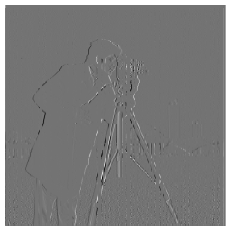
            </figure>
        </td>
        <td style="text-align:center;">
            <figure style="margin:0;">
                <figcaption>Ey</figcaption>
                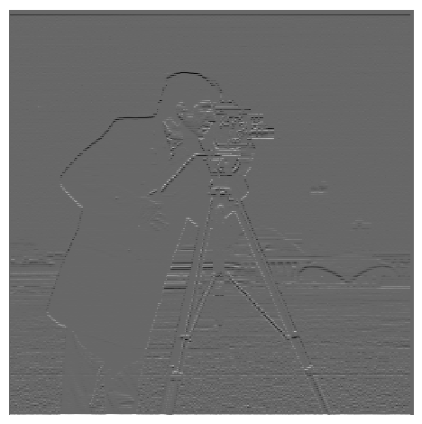
            </figure>
        </td>
    </tr>
    <tr>
        <td style="text-align:center;">
            <figure style="margin:0;">
                <figcaption>Combined Image</figcaption>
                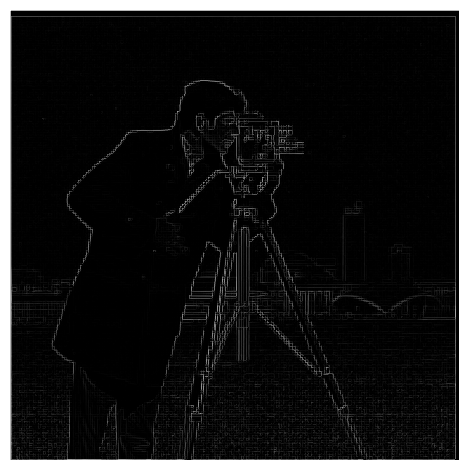
            </figure>
        </td>
        <td style="text-align:center;">
            <figure style="margin:0;">
                <figcaption>Filtered Image</figcaption>
                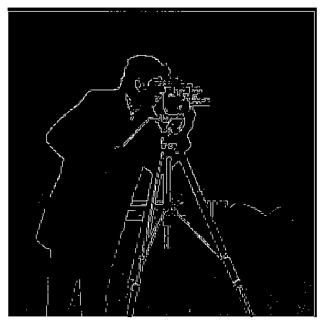
            </figure>
        </td>
    </tr>
</table>

### Part 1.3: Derivative of Gaussian (DoG) Filter

Since the image is still somewhat noisy, smoothing/blurring the image prior to convolving with the finite difference kernel helps remove some of that noise. Essentially, given a gaussian kernel $G$, we have

$$
    E_x = A * G * \begin{bmatrix} 1 & -1 \end{bmatrix} \\
    E_y = A * G * \begin{bmatrix} 1 \\ -1 \end{bmatrix}
$$

Because convolution is associative, we can either:
1. Apply the gaussian filter to the image and then find the gradients of the blurred image
2. Compute the derivative of the gaussian (DoG) by convolving the finite difference operators with the gaussian filter. Then, we can directly convolve the DoG filter to the image.

The results are as follows:
<table style="width: 90%; table-layout:fixed;">
    <tr>
        <td style="text-align:center;">
            <figure style="margin:0;">
                <figcaption>Approach 1 Unfiltered</figcaption>
                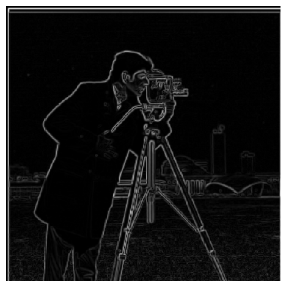
            </figure>
        </td>
        <td style="text-align:center;">
            <figure style="margin:0;">
                <figcaption>Approach 1 Filtered</figcaption>
                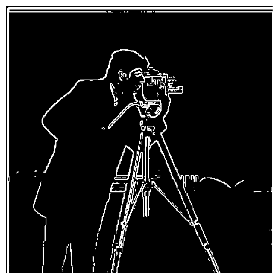
            </figure>
        </td>
    </tr>
    <tr>
        <td style="text-align:center;">
            <figure style="margin:0;">
                <figcaption>Approach 2 Unfiltered</figcaption>
                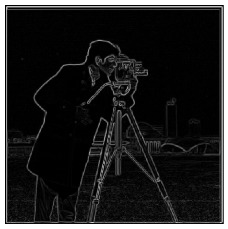
            </figure>
        </td>
        <td style="text-align:center;">
            <figure style="margin:0;">
                <figcaption>Approach 2 Filtered</figcaption>
                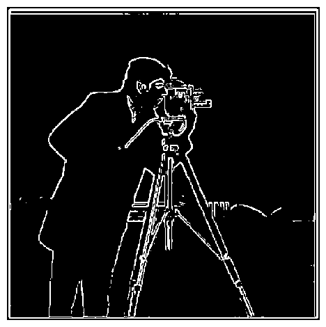
            </figure>
        </td>
    </tr>
</table>

## Part 2: Fun with Frequencies!

### Part 2.1: Image "Sharpening"
The approach is to filter the high frequency values, and emphasize them by "adding" it to the original image. To find the high frequency values, we compute `details = image - blurred`, and thus our `result` becomes `image + alpha * details`, where `alpha` is a tunable constant. This can be computed by performing a single convolution. If we denote $I$ as the identity convolution (an odd kernel with all zeros except for the center element being $1$).

$$
    S = I * A + \alpha (I * A - G * A) \\
    = (I + \alpha (I - G)) * A \\
    = ((1 + \alpha) - \alpha G) * A
$$

#### Taj Mahal

<table style="width: 90%; table-layout:fixed;">
    <tr>
        <td style="text-align:center;">
            <figure style="margin:0;">
                <figcaption>Original</figcaption>
                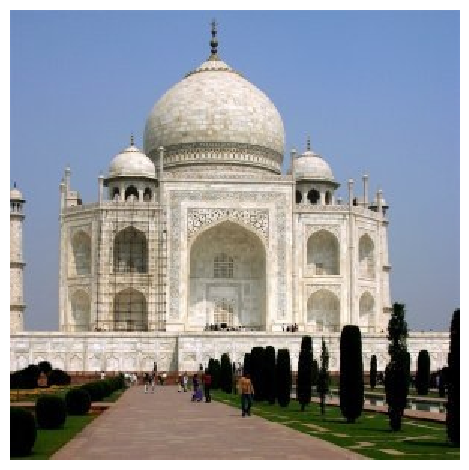
            </figure>
        </td>
        <td style="text-align:center;">
            <figure style="margin:0;">
                <figcaption>alpha = 1</figcaption>
                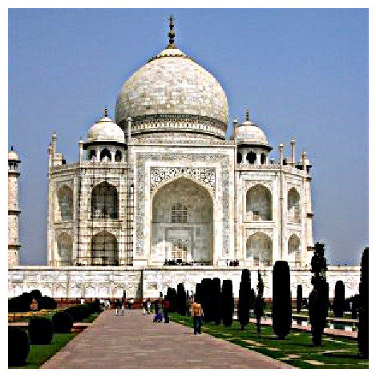
            </figure>
        </td>
        <td style="text-align:center;">
            <figure style="margin:0;">
                <figcaption>alpha = 2</figcaption>
                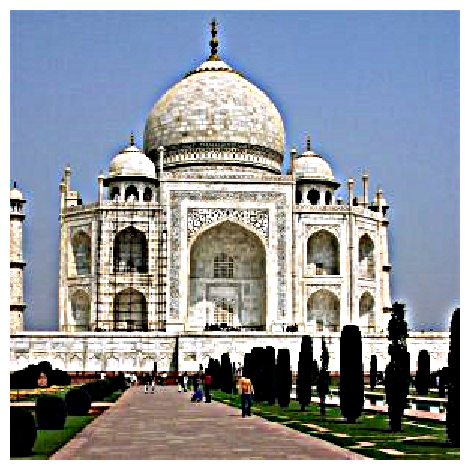
            </figure>
        </td>
    </tr>
</table>

#### Clouds
<table style="width: 90%; table-layout:fixed;">
    <tr>
        <td style="text-align:center;">
            <figure style="margin:0;">
                <figcaption>Original</figcaption>
                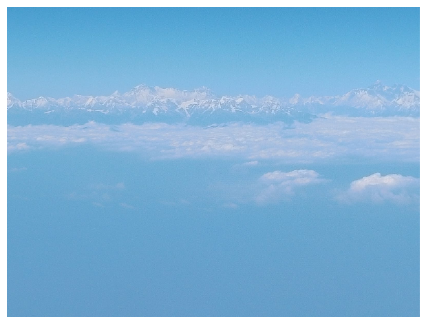
            </figure>
        </td>
        <td style="text-align:center;">
            <figure style="margin:0;">
                <figcaption>alpha = 1</figcaption>
                
            </figure>
        </td>
        <td style="text-align:center;">
            <figure style="margin:0;">
                <figcaption>alpha = 2</figcaption>
                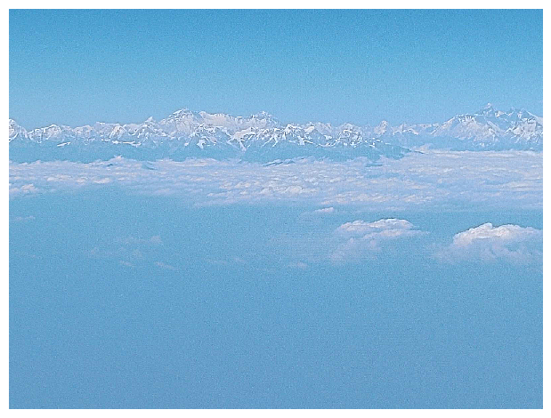
            </figure>
        </td>
    </tr>
</table>

Again, here we can see that the mountain's features are more visible.

#### Resharpening a Blurred Image (Pyramids)
<table style="width: 90%; table-layout:fixed;">
    <tr>
        <td style="text-align:center;">
            <figure style="margin:0;">
                <figcaption>Original</figcaption>
                
            </figure>
        </td>
        <td style="text-align:center;">
            <figure style="margin:0;">
                <figcaption>Blurred</figcaption>
                
            </figure>
        </td>
        <td style="text-align:center;">
            <figure style="margin:0;">
                <figcaption>Resharpened</figcaption>
                
            </figure>
        </td>
    </tr>
</table>

The reconstructed image has quite a few artifacts since a lot of the finer details are lost to the blurring process. However, most of the features aren't washed away, unlike the blurred image.

### Part 2.2: Hybrid Images

To achieve a blurred image, I overlayed a low frequency and high frequency image. The low frequency image was produced by applying a gaussian blur. For the high frequency image, I took the difference between the original image and a blurred image.

#### Is it a bird? Is it a plane?
I used a Gaussian blur with mean 6 and variance 12.

<table style="width: 90%; table-layout:fixed;">
    <tr>
        <td style="text-align:center;">
            <figure style="margin:0;">
                <figcaption>Bird</figcaption>
                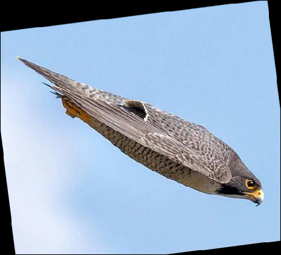
            </figure>
        </td>
        <td style="text-align:center;">
            <figure style="margin:0;">
                <figcaption>Plane</figcaption>
                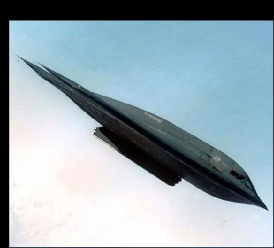
            </figure>
        </td>
        <td style="text-align:center;">
            <figure style="margin:0;">
                <figcaption>Combined</figcaption>
                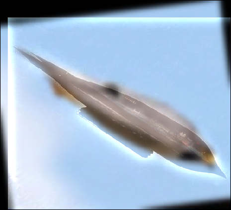
            </figure>
        </td>
    </tr>
</table>

#### It's Superman!
Again, I used a Gaussian blur with mean 6 and variance 12.

<table style="width: 90%; table-layout:fixed;">
    <tr>
        <td style="text-align:center;">
            <figure style="margin:0;">
                <figcaption>Clark Kent</figcaption>
                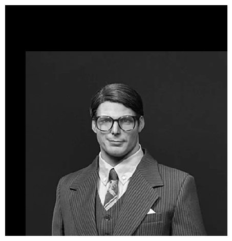
                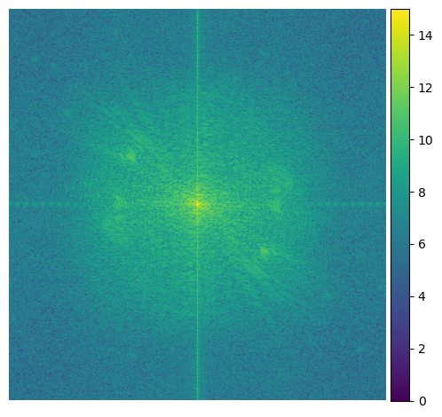
            </figure>
        </td>
        <td style="text-align:center;">
            <figure style="margin:0;">
                <figcaption>Superman</figcaption>
                
                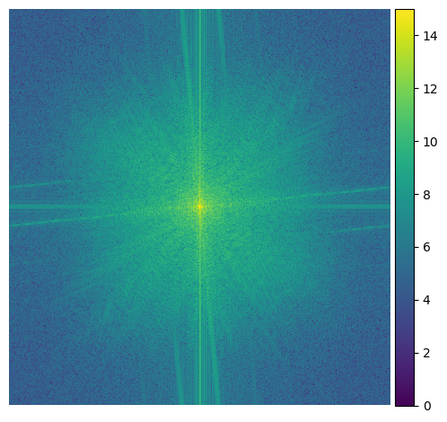
            </figure>
        </td>
    </tr>
    <tr>
        <td style="text-align:center;">
            <figure style="margin:0;">
                <figcaption>High Pass Clark Kent</figcaption>
                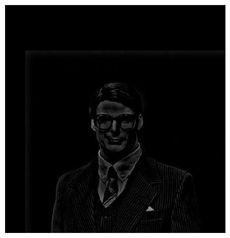
                
            </figure>
        </td>
        <td style="text-align:center;">
            <figure style="margin:0;">
                <figcaption>Low Pass Superman</figcaption>
                
                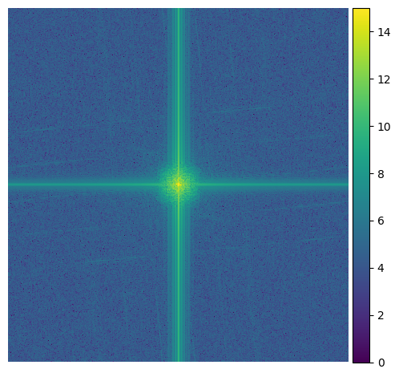
            </figure>
        </td>
    </tr>
    <tr>
        <td colspan="2" style="text-align:center;" style="text-align:center; width:0.45%;">
            <figure style="margin:0;">
                <figcaption>High Pass Clark Kent</figcaption>
                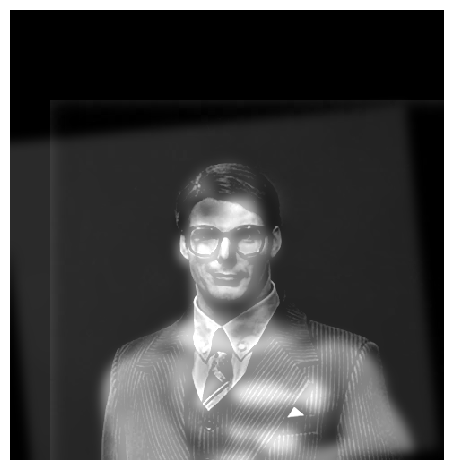
                
            </figure>
        </td>
    </tr>
</table>

#### Mario (Failed Attempt)

This set of images just didn't seem to work since the retro Mario was much larger than the modern Mario. As such, a lot of the details got washed away in the background.

<table style="width: 90%; table-layout:fixed;">
    <tr>
        <td style="text-align:center;">
            <figure style="margin:0;">
                <figcaption>Mario 2D</figcaption>
                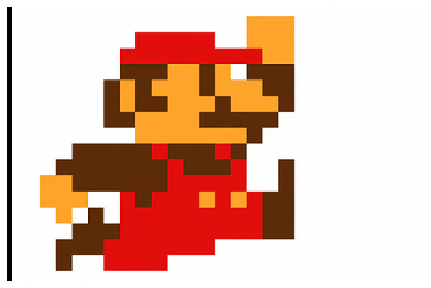
            </figure>
        </td>
        <td style="text-align:center;">
            <figure style="margin:0;">
                <figcaption>Mario 3D</figcaption>
                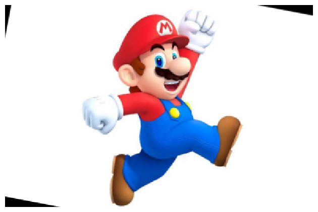
            </figure>
        </td>
        <td style="text-align:center;">
            <figure style="margin:0;">
                <figcaption>Combined (Failed)</figcaption>
                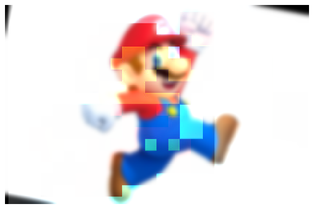
            </figure>
        </td>
    </tr>
</table>

### Part 2.3 & 2.4: Gaussian + Laplacian Stacks and Multiresolution Blending

Each level of the Gaussian stack is produced by blurring the previous level. The Laplacian stack is formed by taking differences of adjacent layers of the Gaussian stack. The last layer of the Gaussian stack is appended to the end of the Laplacian stack, so both end up with the same number of layers.

Pictured are layers 0, 2, and 4 of each layer of the Laplacian stack.

<table style="width: 90%; table-layout:fixed;">
    <tr>
        <td style="text-align:center;">
            <figure style="margin:0;">
                <figcaption>Apple Layer 0</figcaption>
                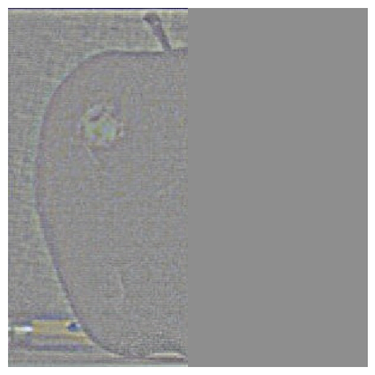
            </figure>
        </td>
        <td style="text-align:center;">
            <figure style="margin:0;">
                <figcaption>Orange Layer 0</figcaption>
                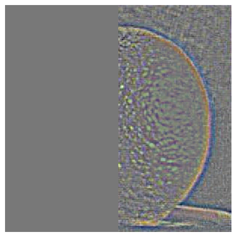
            </figure>
        </td>
        <td style="text-align:center;">
            <figure style="margin:0;">
                <figcaption>Combined Layer 0</figcaption>
                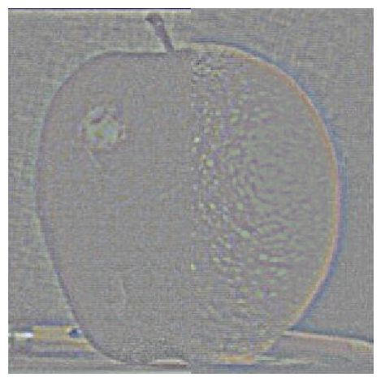
            </figure>
        </td>
    </tr>
    <tr>
        <td style="text-align:center;">
            <figure style="margin:0;">
                <figcaption>Apple Layer 2</figcaption>
                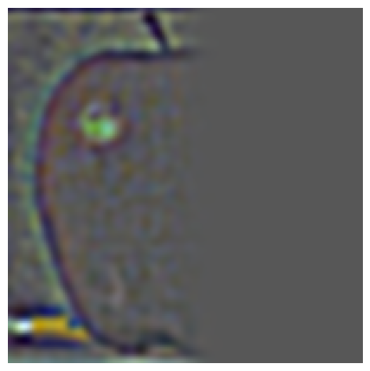
            </figure>
        </td>
        <td style="text-align:center;">
            <figure style="margin:0;">
                <figcaption>Orange Layer 2</figcaption>
                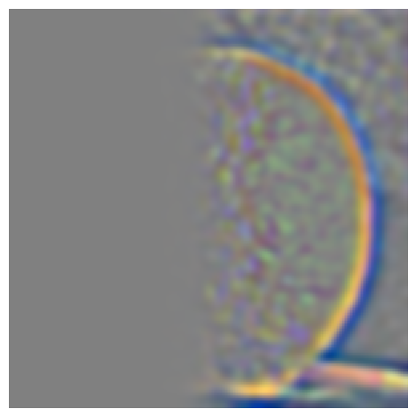
            </figure>
        </td>
        <td style="text-align:center;">
            <figure style="margin:0;">
                <figcaption>Combined Layer 2</figcaption>
                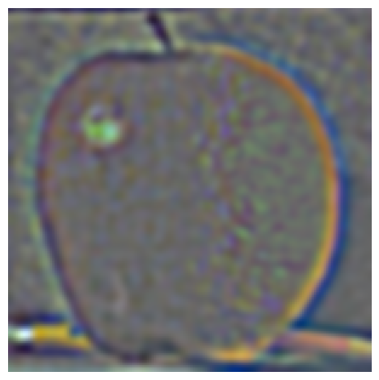
            </figure>
        </td>
    </tr>
    <tr>
        <td style="text-align:center;">
            <figure style="margin:0;">
                <figcaption>Apple Layer 4</figcaption>
                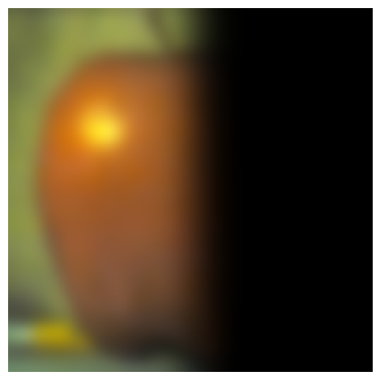
            </figure>
        </td>
        <td style="text-align:center;">
            <figure style="margin:0;">
                <figcaption>Orange Layer 4</figcaption>
                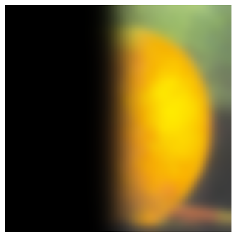
            </figure>
        </td>
        <td style="text-align:center;">
            <figure style="margin:0;">
                <figcaption>Combined Layer 4</figcaption>
                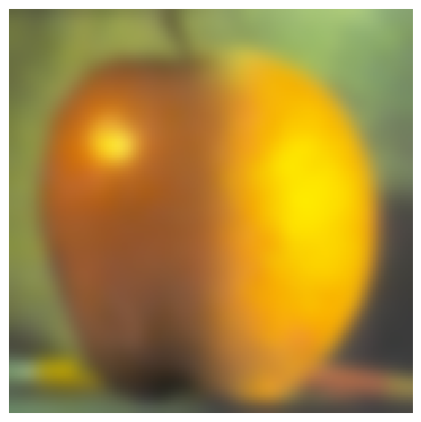
            </figure>
        </td>
    </tr>
    <tr>
        <td colspan="3" style="text-align:center; width:33%;">
            <figure style="margin:0;">
                <figcaption>Final Result</figcaption>
                
                <!-- Note: We're shrinking it by multiplying 33.3 by 0.9 -->
            </figure>
        </td>
    </tr>
</table>

We can also use irregular masks.

<table style="width: 90%; table-layout:fixed;">
    <tr>
        <td style="text-align:center;">
            <figure style="margin:0;">
                <figcaption>Duck</figcaption>
                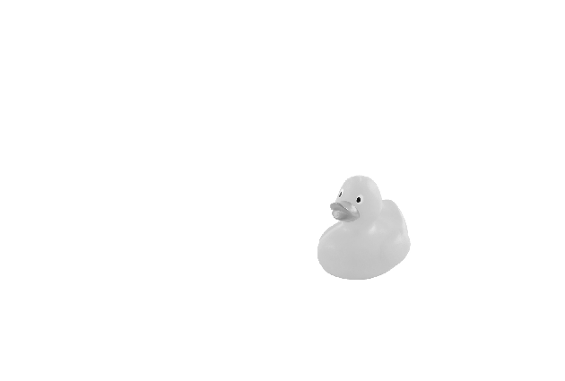
            </figure>
        </td>
        <td style="text-align:center;">
            <figure style="margin:0;">
                <figcaption>City</figcaption>
                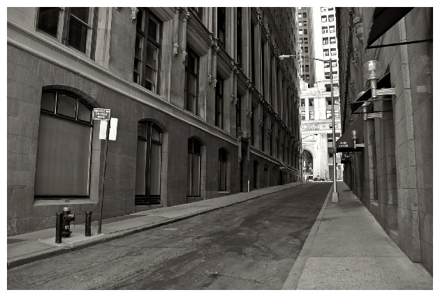
            </figure>
        </td>
    </tr>
    <tr>
        <td style="text-align:center;">
            <figure style="margin:0;">
                <figcaption>Duck Mask</figcaption>
                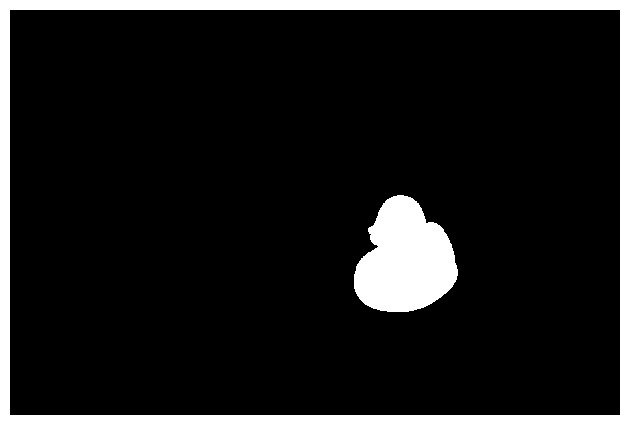
            </figure>
        </td>
        <td style="text-align:center;">
            <figure style="margin:0;">
                <figcaption>What are you doing here?</figcaption>
                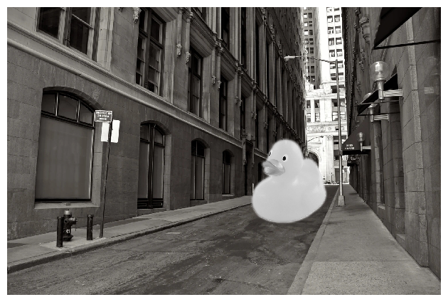
            </figure>
        </td>
    </tr>
</table>

<table style="width: 90%; table-layout:fixed;">
    <tr>
        <td style="text-align:center;">
            <figure style="margin:0;">
                <figcaption>Cat</figcaption>
                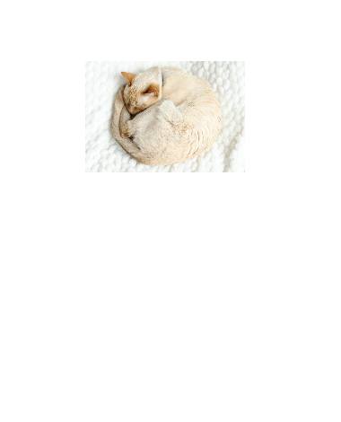
            </figure>
        </td>
        <td style="text-align:center;">
            <figure style="margin:0;">
                <figcaption>Ice Cream Cone</figcaption>
                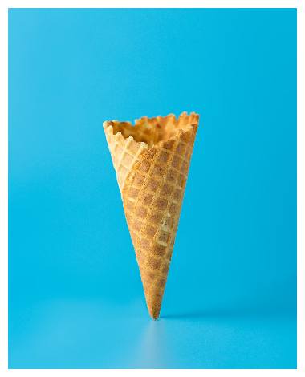
            </figure>
        </td>
    </tr>
    <tr>
        <td style="text-align:center;">
            <figure style="margin:0;">
                <figcaption>Cat Mask</figcaption>
                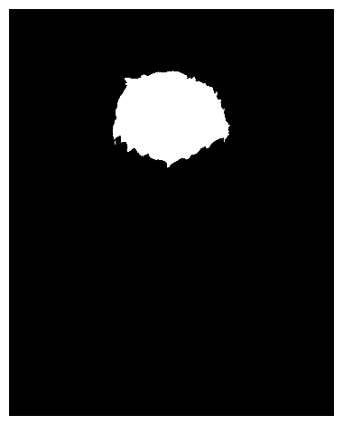
            </figure>
        </td>
        <td style="text-align:center;">
            <figure style="margin:0;">
                <figcaption>Purrfection</figcaption>
                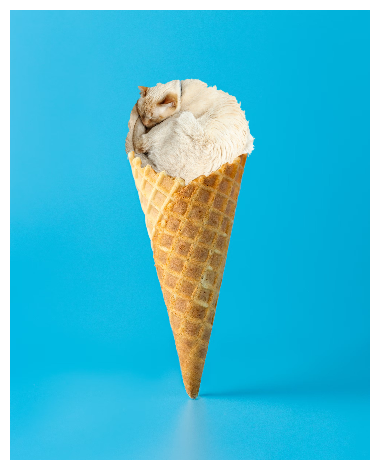
            </figure>
        </td>
    </tr>
</table>